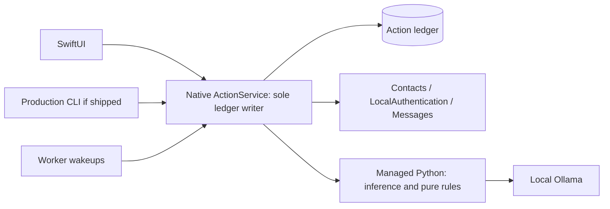
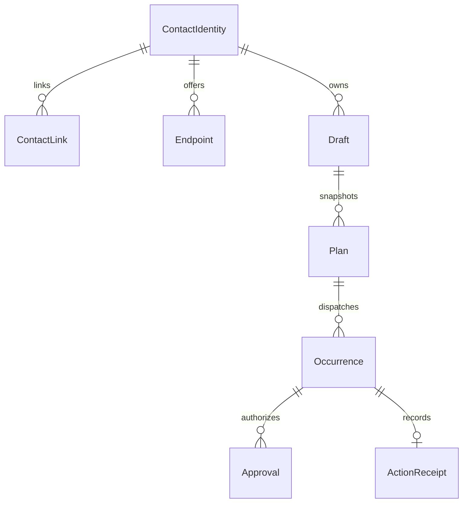
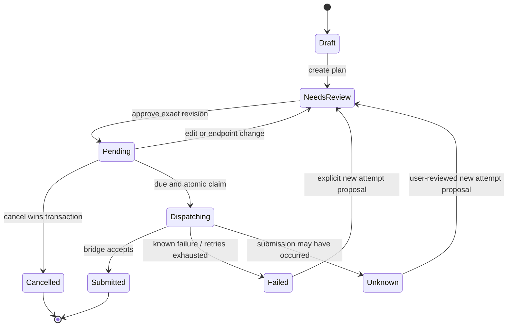

# Desktop build specification — revision 2

Status: proposed implementation baseline, 2026-09-24. Supplements and takes precedence
over the broad roadmap in DESKTOP_TRANSFORMATION_PLAN.md where scope/order differs.
No real contact, authentication, delivery, or background service changes are made by
these planning artifacts. The clickable prototype uses synthetic in-memory data only.

Native milestone A implementation: see [desktop/README.md](../desktop/README.md).
The SwiftUI prototype uses synthetic in-memory data; native system integration remains
phase B. Approval and lock state in the prototype are demonstrations, not production security.

## 1. Firm release boundary

| Capability | V1 required | Later |
| --- | --- | --- |
| Assistant | Selected direct history, generate/cancel, editable draft, language override, sources | Group context, media understanding, autonomous replies |
| Manual Plan | Compose, one-time schedule, edit before dispatch, cancel, global delivery pause | Recurrence creation/editing, per-plan pause, skip, calendar |
| Contacts | Authorized read, search, reviewed create/update, conflict handling, app-local preferences | Bulk changes, automatic merges, deleting native cards from this app |
| Contacts sync | System change refresh, source-aware writes, JSON linking review | App-owned cloud sync |
| Unlock | Native owner authentication with available Watch/Touch ID and system password fallback | Custom Watch app or cloud login |
| Delivery | Exact review, version-bound approval, idempotent action tracking, one-time background jobs | Groups and SMS in the app UI |
| Memory | View/edit/forget approved preferences; explicit feedback approval | Passive learning or model retraining |
| Release | Signed Mac app, diagnostic setup, accessible UI, installation/upgrade tests | App Store, Windows, iPhone companion |

The GUI supports one-to-one iMessage only in V1. Phone endpoints remain the supported
history identity; email values are editable contact fields, not new delivery targets.
Legacy recurring/SMS jobs remain in the old store and are not activated by migration.
Show them as unsupported legacy items with explicit migration guidance. Before enabling
the new worker, verify the old worker is stopped; do not run both delivery systems.
Import only approved compatible one-time jobs after a reviewed preview.

Release gates: V1 is blocked if authentication enforcement, contact conflict behavior,
approval integrity, or installed one-time delivery fail. Optional UI polish cannot hide
these blockers. Recurrence is removed from V1 controls, not shown as a dead button.

## 2. Screens and concrete flows

Prototype: prototypes/desktop-v1.html. It demonstrates navigation, manual editing,
review/invalidation, a contact conflict, and a simulated lock. It is not SwiftUI and
cannot authenticate, sync, infer, persist, schedule, or send. Reload resets its data.
Native platform feasibility is still a separate milestone. Static checks passed for
unique element IDs, control/label references, local links, and absence of network or
persistent-storage APIs. Browser visual/interaction verification is pending: the
browser tool blocked the local file URL; no alternate route was attempted.

| Screen | Primary action | Progressive disclosure | Required states |
| --- | --- | --- | --- |
| Assistant | Review draft | Optional AI controls and input sources | No selection, loading, generating, cancelled, missing context, model unavailable, draft |
| Plan | New message | Timezone and delivery details | Empty, needs review, pending, dispatching, submitted, cancelled, failed, unknown |
| Contacts | Save to Mac Contacts | Source account and local preferences | Loading, read-only, editing, unsaved, conflict, revoked access, unavailable link |
| Unlock | Unlock | Help if system authentication unavailable | Locked, system prompt, cancelled, success, unavailable |
| Review | Approve exact action | Expanded endpoint/timezone | Current preview, stale preview, locked session, approved |
| Settings | Resolve setup issue | Diagnostics/export | Missing permission/model, ready, paused delivery |

Design decisions: sidebar + main workspace; no permanent status footer. One compact
status line appears only for actionable issues. AI tools collapse, contact editing is
manual, and the default Plan view is an agenda. Use system fonts, native form controls,
light/dark appearance, focus indicators, and descriptive text with status colors.

Core flows:
1. Manual: Plan → New message → pick contact/endpoint → type → choose time → review → approve.
2. AI: Assistant → pick contact → inspect history → request draft → edit → review → approve.
3. Contact: Contacts → select card → edit → refetch/compare → review conflicts → save → refetch.
4. Plan edit: pending job → edit → atomic revoke-and-revise → needs review → new approval.
5. Recovery: unknown outcome → inspect activity/Messages → user decides; never auto-resubmit.

Prototype review tasks: navigate all three destinations; edit the demo plan after
approval and observe Needs review; resolve the contact conflict; lock/unlock the demo.
All primary controls must work at keyboard-only input and narrow width. Native tests
must additionally verify VoiceOver, focus restoration, native sheets, and system prompts.

## 3. Authoritative ownership and process boundary

Native ActionService owns the production SQLite action ledger, approvals, queue claims,
contact mappings, pause/session authority, and dispatch. Only it opens this database
for writes. Python provides model calls, parsing, and reusable pure validation functions;
it is not allowed to mark an action approved or submitted. SwiftUI and the worker use
the same native service. Production CLI calls this service or is omitted from the build.
Existing direct Python writers remain a development path, not a production bypass.

Python guardrails can provide detailed diagnostics, but native dispatch must independently
enforce approval/version, identity, limits, pause and quiet-hour invariants. The extraction
spike determines which pure rules can be shared; duplicated critical rules need parity
fixtures, not assumptions. This is a deliberate migration from the existing engine.



Native clients use authenticated XPC where feasible. The managed Python child receives
bounded requests through private framed stdio. Its responses are untrusted suggestions.
Phase B must validate signed caller identity, helper lifecycle, and permission attribution.
If it fails, revise this boundary before implementation; do not substitute an open HTTP API.

## 4. Data model

All IDs are opaque app-owned IDs. All timestamps are UTC plus an explicit IANA timezone
where user time semantics matter. A monotonically increasing revision supports stale-write
checks. Additive schema migrations are recorded and run under exclusive migration ownership.

| Entity | Key fields | Invariant |
| --- | --- | --- |
| ContactIdentity | id, revision, link_state, selected_endpoint_id | Preferences follow app identity, never just a name |
| ContactLink | app_contact_id, native_id, container_id, source_snapshot, sync_token | Native IDs are remappable references, not immutable global identities |
| Endpoint | id, contact_id, normalized_value, label, revision, available | Selecting another endpoint invalidates an action preview |
| Preference | id, contact/global scope, key, value, approval_source | Existing explicit approval semantics retained |
| Draft | id, contact_id, endpoint_id, body, revision, source_ids, generation_id | Late generation can only update its original unchanged draft revision |
| Plan | id, revision, draft_snapshot, due_at, timezone, state | V1 is one-time only; body/destination/time changes revoke approval |
| Occurrence | id, plan_id, plan_revision, due_at, state, claim_id | One logical dispatch identity; recurring extension is deferred |
| Approval | id, action_id, content_digest, plan_revision, endpoint_snapshot, policy_revision, session_id, revoked_at | Bound to exact canonical action; never merely approved=true |
| ActionReceipt | action_id, request_id, state, submitted_at, error_class | Repeated request IDs retrieve the same outcome |
| AuditEvent | id, action_id, event_type, timestamp, redacted_detail | No passwords or copied history bodies in diagnostics |



Draft-to-plan creates an immutable content snapshot; later unrelated draft edits do not
change queued text. ActionService only dispatches the version referenced by its approval.
Known endpoint removal/change invalidates pending approval. Failed identity refresh defers
action when required validity cannot be established. Rename-only changes preserve identity.

## 5. State and concurrency contract



Global pause is a delivery policy, not an additional plan state. Known pre-submission
retry uses the same occurrence, persisted backoff, and a recheck of all dispatch rules.
Unknown outcomes are never retried automatically. A retry proposal after Failed/Unknown
gets a new action ID and approval, retaining a link to the previous receipt.

| Operation | Allowed state | Atomic effect / rejection |
| --- | --- | --- |
| Approve | NeedsReview | Compare revision/digest/session; create approval and set Pending |
| Edit | Draft, NeedsReview, Pending | Compare expected revision; revoke approval + write revision + NeedsReview in one transaction |
| Cancel | NeedsReview, Pending | Compare revision and set Cancelled before worker can claim |
| Claim | Pending | Recheck due/approval/policy; compare-and-swap to Dispatching; persist claim before OS call |
| Edit/cancel claimed job | Dispatching | Reject as in-flight; never imply recall |
| Repeated submit request | Any known action | Return existing receipt/state; do not invoke bridge twice |
| Crash after claim | Dispatching | Recover as Unknown unless evidence proves no submission was attempted |

The linearization point is the committed claim transaction. Edits/cancels/pause committed
before it prevent dispatch; changes after it may not stop the in-flight OS operation.
A UI timeout does not create a new action. Query status by action ID. SQLite cannot make
an external AppleScript send exactly-once: expose this remaining uncertainty honestly.

## 6. Contact conflict and migration contract

V1 edits name/phone/email on supported writable cards; deletes remain in Apple's Contacts
app. Incoming native deletion marks a link unavailable; permission loss is distinguished
from deletion. Unified/linked cards without a deterministic writable target open in Contacts
instead of risking writes to the wrong account. Creates require an explicit writable container.

Three-way comparison: base snapshot, local edit, fresh native record. Merge disjoint fields;
ask for each conflicting field. Before save revalidate, and after save refetch. The native
save/conflict semantics must be established in B: prefetch+save alone is not an atomic
compare-and-swap. If concurrent overwrites cannot be detected for a card type, gate in-app
editing for that case and expose Open in Contacts. Do not claim universal conflict safety.

Import process: backup old store → dry migration/report → review identity collisions →
transactional import → compare counts/IDs/preferences → activate new app. Never delete the
source JSON or old database. A migration marker prevents double import. Restore testing uses
a copy; once new actions exist, rollback must preserve their receipts to avoid re-sending.

## 7. Authentication and delivery policy contract

Proposed defaults now fixed for prototype: five-minute app inactivity lock; immediate
lock on sleep/system lock/user switch; closing last window locks; generation results after
lock are discarded. A lock event invalidates UI session tokens in ActionService, not only
in SwiftUI. A crashed/disconnected UI session is locked. Startup requires authentication.
Use monotonic time for session expiry; wall-clock changes must not extend a session.

Native session capability is opaque, short-lived, process-bound and unforgeable by model
output. System authentication must be checked inside the trusted native boundary. Details
of capability transport and caller validation are a B-phase architecture deliverable.

Fresh authentication (proposed 60-second freshness window) is required before enabling
unattended delivery and native contact writes. Exact action review remains required even
with recent authentication. Regular sends require an unlocked valid session plus exact
approval. Pending auth cancelled or expired means no mutation.

Default delivery policy: pause while locked. Optional explicitly approved policy permits
only existing approved jobs while locked. If auth/session service health is unknown, pause.
A new job or edit always requires an unlocked session. Quit/close follows the displayed
policy; application crash never creates a new permission to continue. After user logout,
resume behavior is not promised until next login and policy recovery.

Encryption decision gate: protect saved drafts and bodies at rest with Keychain-managed
keys only after validating access groups, recovery, and locked worker needs. Unattended
mode needs worker-readable approved payloads, distinct from interactive draft access.
Document the threat model: app lock cannot stop every malicious same-user process or
protect plaintext already in Messages. Release cannot claim encrypted queue protection
until key-loss, lock-state and installed-worker tests pass.

## 8. Service interface examples

These are schema-level contracts to finalize in B/C, not a chosen wire encoding:

```text
preview_action(request_id, draft_id, expected_revision, endpoint_id, due_at?, timezone?)
  -> preview_id, canonical_action, digest, expires_at, warnings
approve_action(preview_id, expected_digest, session_capability)
  -> action_id, approved_revision OR stale_preview/locked/identity_changed
revise_plan(plan_id, expected_revision, changes, session_capability)
  -> new_revision, state=needs_review OR stale_revision/in_flight
execute_action(action_id, request_id)
  -> existing_or_new_receipt (service checks approval and policy)
update_contact(contact_id, base_snapshot, changes, session_capability)
  -> refreshed_contact OR conflict/read_only/permission_denied
```

Transport cancellation stops inference and UI interest; it never cancels a committed
send. Request-size limits, deadlines, redaction, protocol versioning, event ordering,
connection restart, and error schemas are required C deliverables. No password enters IPC.

## 9. Executable backlog and acceptance criteria

Effort: S = bounded component; M = cross-component; L = substantial integration. These
are sizing hints, not deadlines. Estimate calendar time after B. Roles name responsibilities,
not additional agents: Native, Engine, Design, QA may all be performed sequentially.

| ID | Task / owner | Depends on | Size | Done when |
| --- | --- | --- | --- | --- |
| A1 | Freeze V1 and screen states / Design | — | S | Scope table agreed; deferred controls absent |
| A2 | Clickable synthetic prototype / Design | A1 | M | Assistant/Plan/Contacts/review/conflict/lock flows demonstrable; no side effects |
| B1 | Signed app + bundled Python proof / Native | A1 | L | Launches on target Mac without developer shell; helper exits/restarts cleanly |
| B2 | Permission and authentication matrix / Native | B1 | M | System password success/cancel plus available Watch/Touch ID tested; no secret logs |
| B3 | Native Contacts conflict spike / Native | B1 | L | Dedicated test card read/create/update; competing edit outcome recorded; linked-card policy chosen |
| B4 | Broker/storage/key architecture decision / Native | B1,B2 | L | Single writer, caller identity, lock health, key access and migration decisions documented |
| C1 | Versioned domain schema + migrations / Engine | B3,B4 | L | Fixture upgrade/restart/double-import/restore tests pass; original data untouched |
| C2 | Typed service + IPC adapter / Native+Engine | C1 | L | Unauthorized/stale/oversized/repeated requests rejected or deduplicated with receipts |
| C3 | Atomic approval/dispatch contract / Native | C2 | L | Edit/cancel/claim races deterministic; replay never creates second bridge invocation |
| D1 | Contacts repository and sync / Native | B3,C2 | L | Source-aware edits; notification refresh; expiry rescan; no self-write loops |
| D2 | Contact migration review UI / Design+Engine | D1,C1 | M | Ambiguous matches require review; stable IDs/preferences preserved |
| D3 | Manual Plan UI / Design+Native | A2,C3 | M | Compose, schedule, edit, cancel with model offline; edit revokes approval |
| E1 | Cancellable draft bridge / Engine | C2 | M | Switching contact/revising draft cannot receive stale output |
| E2 | Assistant and preferences UI / Design | E1,D1 | M | Sources expandable; override not persisted; edits survive regeneration |
| F1 | Lock/session enforcement / Native | B2,B4,C2 | L | Backend denies mutations after lock/cancel/expiry, even with open GUI connection |
| F2 | Review and submit UI / Native | C3,F1,D3 | M | Review shows exact endpoint/text/time; changed preview rejected; duplicate click reuses action |
| G1 | One-time worker and pause policy / Native | F2,B4 | L | Policy loss pauses; login restart recovers; no unapproved dispatch |
| G2 | Controlled live delivery acceptance / QA | G1 | M | Separately authorized recipient gets one message; cancellation and unknown outcome reviewed |
| H1 | Accessibility and error recovery / QA | D2,E2,F2 | M | Keyboard/VoiceOver, resize, offline, permission and conflict scenarios pass |
| H2 | Packaging/upgrade/release / Native+QA | G2,H1 | L | Signed distribution, fresh install/upgrade/key recovery and docs pass; private files excluded |

Critical path: B1 → B4 → C1 → C2 → C3 → F2 → G1 → G2 → H2.
B2/B3 feed architecture decisions; A2 provides early product feedback. Do not build the
entire UI before resolving B. Development first uses synthetic data and mocked OS actions.
Live sends remain deferred under the user's current draft-only instruction.

## 10. Measurable acceptance and decision log

Hard correctness gates:
- Given 20 repeated execute requests with one action ID, bridge invocation count ≤ 1.
- An edit committed before worker claim means the old approved revision never dispatches.
- A failed/expired/cancelled authentication produces zero mutations.
- Switching contact during generation attaches zero results to the new contact.
- Saving a contact conflict never silently overwrites a detected competing field change.
- Model unavailable: manual contact/plan editing remains functional.
- New app migration does not activate any unsupported or unapproved legacy job.
- No real contacts, conversation bodies, keys, or passwords in source-controlled artifacts.

Prototype performance targets (to measure on a documented reference Mac, not promises):
contact search and view switching respond within 200 ms at p95 after local load for
1,000 synthetic contacts; UI never blocks on model calls; generation cancel acknowledgement
within 500 ms. Model completion latency is reported separately by hardware/model/context.

| Decision | Current proposal | Evidence needed / deadline |
| --- | --- | --- |
| Minimum macOS and CPU support | Target user's Apple Silicon Mac for first private build | Installed SDK/API availability, B1 |
| Signed app/helper identities | Stable bundle identities | TCC/Automation behavior from packaged app, B1/B2 |
| Writable unified-card behavior | Restrict ambiguous cases | Real source-account tests, B3 |
| IPC/auth authority | Native broker, sole ledger writer | Caller/session enforcement proof, B4 |
| Locked worker keys | Separate approved-payload access | Key lifecycle and worker access test, B4 |
| Default pause on app lock | Yes | Prototype comprehension and policy tests, A2/F1 |
| Recurrence | Post-V1 | Separate backlog after one-time release |

Release review records tests as pass/fail/deferred with actual platform versions. An
unresolved hard gate blocks release; it is not converted to a passing claim by a mock.
