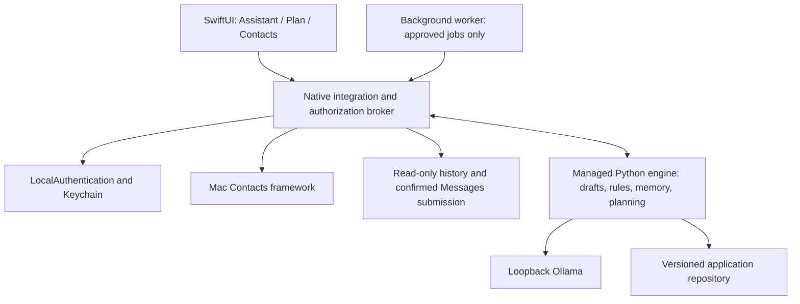

# Native Mac app transformation plan

Planning revision: 2026-09-24 (roadmap; see revision 2 specification). This is a proposed product and engineering plan, not an
implementation claim. No contact writes, account changes, authentication changes, or
message sends are authorized merely by this document.

The [revision 2 build specification](DESKTOP_BUILD_SPEC.md) takes precedence for V1 scope,
architecture ownership, state transitions, session defaults, and implementation order.
The [clickable prototype](prototypes/desktop-v1.html) uses synthetic data only.

## 1. Product decision

Build a native SwiftUI macOS app with three primary destinations: Assistant, Plan,
and Contacts. Settings and Activity are secondary. Keep the existing Python assistant
as the local inference and domain engine, and add a native integration layer for
Contacts, LocalAuthentication, Keychain, Messages submission, and app lifecycle.

Goals:
- A calm, minimalist interface that works with keyboard and mouse.
- Full manual control of drafts, schedules, and contacts when Ollama is unavailable.
- Selected-context AI assistance, never automatic analysis of every conversation.
- Two-way integration with the user's Mac Contacts, with visible conflict handling.
- Unlock using macOS authentication: supported Apple Watch, Touch ID, or Mac password.
- Exact-action approval, dependable state transitions, and honest submission statuses.

Proposed first distribution: signed/notarized direct-download app. Prove packaging,
Messages permissions, helper identity, and background behavior before committing to
this route. Mac App Store distribution is a separate feasibility decision. Do not
promise that installing the app grants Contacts, Messages, or Automation access.

## 2. Minimalist visual and interaction design

Use native typography, system controls, SF Symbols, light/dark appearance, and a single
accent color. Neutral surfaces, generous spacing, subtle separators. Avoid gradients,
dashboard metric cards, excessive badges, or a permanently visible wall of AI text.
Color supplements text/icon status; it never carries the only status information.

Proposed layout at a normal desktop width:

```text
┌─────────────────────────────────────────────────────────────────────────────┐
│ App name                           Search                    Lock   Settings │
├─────────────┬──────────────────────────────────────────┬────────────────────┤
│ Assistant   │ Selected workspace                       │ Optional inspector │
│ Plan        │                                          │                    │
│ Contacts    │ List, conversation, or schedule timeline  │ Details / AI help  │
│             │                                          │                    │
│ Activity    │                                          │                    │
├─────────────┴──────────────────────────────────────────┴────────────────────┤
│ Local model ready             Contacts up to date        Delivery paused    │
└─────────────────────────────────────────────────────────────────────────────┘
```

The inspector is collapsible. Narrow windows use a sheet or navigation stack rather
than squeezing three columns. Initial targets: sidebar about 180–220 pt and inspector
about 300–360 pt, adjusted after prototype and accessibility testing. No fixed minimum
that makes enlarged text unusable.

Keyboard: Command–1/2/3 switches destinations, Command–F searches, Command–N creates
an item appropriate to the current screen, Escape dismisses a sheet. Enter inserts a
line break in the message editor; sending always uses a clearly labeled action and
review step. Visible focus states and VoiceOver labels are release requirements.

### Assistant destination

A contact picker, selected conversation, and draft composer form the main workspace.
The selected person remains visible next to every draft. An AI help panel offers:
- Suggest reply; write follow-up; shorten; change language; adjust tone.
- A concise request box and progress/cancel control.
- Optional expandable sources and applied preferences.

Actions: Copy, Edit, Save draft, Review send, Review schedule. Generated text is always
editable. Regeneration creates a new candidate without overwriting a user-edited draft.
Switching contacts cancels or detaches the old request; late output stays with its
original draft and can never become the new contact's text.

If the newest message is outgoing, show “You sent the latest message” with an explicit
“Draft follow-up” action. Unsupported/attachment-only context offers clarification.
Show “Needs context,” not an unexplained disabled Generate button.

### Plan destination — complete manual control

Default to a compact agenda with Today, Upcoming, and Needs attention. An optional
calendar view comes later if it adds value. Each row shows recipient, a short text
preview, time and timezone, recurrence, and status.

Manual controls:
- New draft or schedule, edit text/recipient/time, duplicate as an unapproved draft.
- V1: edit and cancel one-time plans. Later: pause/resume recurrence and skip occurrences.
- Review submission failures and uncertain outcomes; no automatic manual-retry shortcut.
- Pause all background delivery, with a clear persistent indicator.

The inspector exposes exact content, selected phone endpoint, local/recipient time,
next recurrence previews, quiet-hour effects, and approval state. A scheduling wizard
asks for content, destination, and time; it never requires a chat prompt.

Editing an approved schedule invalidates approval and puts the revised version into
Needs review. Until reapproved it cannot send. An item already claimed/submitting cannot
be retroactively edited or recalled. Explain that an in-flight send may finish when
pausing. Manual controls and AI proposals use the SAME service and state rules.

### Contacts destination — complete manual control

Searchable list and detail editor with clear “Mac Contacts” versus “App preferences”
sections. Support names, phone/email values with labels, preferred messaging endpoint,
source account, and contact-link status. Provide Add, Edit, Save, Cancel, Refresh, and
Open in Contacts. Saving displays “Save to Mac Contacts”; local-only preferences display
“Save in this app.”

App preferences include language, tone, timezone, quiet hours, local aliases, and
approved feedback. Contact notes are excluded from initial sync and AI context; do not
request extra note access just to populate a profile.

## 3. Contacts sync design

### Supported behavior

The app reads the authorized system Contacts store through Apple's Contacts framework.
Edits saved by the user in the app update that store. Changes made in Contacts or arriving
through an enabled account are refreshed into the app. Apple's account services handle
propagation between Mac/iPhone/iCloud; this app does not create a separate cloud sync
service or request an Apple Account password.

“Parallel sync” means both apps can be used together with background refresh and
conflict detection. It is not instantaneous distributed consistency. “Saved to Mac
Contacts” is distinct from “synced to your iPhone”; we cannot infer remote delivery
from a successful local save. Source accounts may have different write permissions.

### Data ownership

| Data | Authority | App handling |
| --- | --- | --- |
| Name, phones, emails, account membership | Mac Contacts | Authorized cache plus explicit system-store writes |
| Local aliases and selected message endpoint | App | Stored separately; do not overwrite system fields |
| Language, tone, timezone, quiet hours | App | Explicit preferences tied to stable app identity |
| Messages history | Messages database | Read only for selected context; no full-history import |
| Drafts, plans, approvals, outcomes | App database | Versioned local state |

### Sync algorithm

1. Request Contacts permission with a clear explanation; support denied/revoked and
   whatever access scope the supported macOS version provides.
2. Initial fetch on a background queue; select only necessary keys. Surface account
   scope and count, never block the main UI thread with an address-book scan.
3. Observe CNContactStoreDidChange, debounce refreshes, and refetch cached objects.
4. Use change-history tokens where supported. Save a token only after successful local
   application; expired/unavailable history triggers a full authorized rescan.
5. Every edit retains the original field snapshot. Before saving, refetch and compare.
   Merge disjoint field edits; present a field-level choice for competing edits. Do not
   silently use last-write-wins on phone numbers or names.
6. Serialize writes through a native contact writer; use CNSaveRequest. Refetch after
   saving and reconcile own notifications so there is no write-notification loop.
7. If saving fails, retain an explicitly unsaved local edit. Do not silently queue a
   future overwrite; retry refetches and checks for conflicts again.
8. On deletion, missing access, account removal, or ambiguous identity, mark the link
   unavailable and prevent new actions through it until resolved. Permission loss must
   not be mistaken for mass contact deletion.

Linked/unified cards need special handling: preserve mappings to native identities and
account/container information; do not assume one displayed card always equals one
writable source record. Show the destination account for creates; expose read-only
sources and verify save results. Native contact identifiers are linkage references,
not guaranteed permanent global person IDs.

### Existing JSON migration

Preserve current app contact IDs so preferences retain ownership. Make a local backup,
then match the imported JSON to authorized native contacts by normalized phone/email.
Auto-link only unambiguous matches; never merge people by name alone. Present collisions,
shared numbers, and multiple matches for review. App-only contacts remain local until
explicitly linked or created in Mac Contacts. Never upload the entire old JSON blindly.

Keep contact preference overrides separate from native values. After migration,
contacts.json becomes an explicit import/export format rather than a competing writable
source of truth. CLI contact lookups must move to the shared repository to avoid stale
JSON and app records disagreeing.

### Effect on schedules

A plan stores the approved contact ID AND exact endpoint snapshot. A phone number edit
must never silently redirect an approved message. For known address changes/deletions,
mark affected pending plans Needs review; preview the old and new destination. A label
rename alone updates presentation without moving preferences. A worker that cannot
validate required contact identity must defer rather than guess.

## 4. Unlock with Mac password, Touch ID, or Apple Watch

Use LocalAuthentication through LAContext and the device-owner policy. Apple documents
macOS support for Touch ID, Apple Watch, and the user's password. Check available
capabilities at runtime; offer a single “Unlock” action and let macOS present supported
methods. The Mac login password is checked by macOS: never collect it in an app-owned
text field, send it to Python/Ollama, or store it.

This is local app unlock for the current macOS user, not an online account or Sign in
with Apple. Apple Watch use depends on hardware, watch state, system settings, and OS
policy. The app cannot promise Watch authentication on every attempt or force its use.
Password fallback must remain available through the system flow. No separate Watch app
is needed for the initial system-authentication design.

Recommended defaults, to validate in usability testing:
- Unlock on launch; auto-lock on system lock, sleep, or user switching.
- Five-minute idle lock, configurable; a manual Lock action always available.
- Mask content in the locked window and notifications; stop generation on lock and
  discard late results. Reconcile drafts safely after unlock.
- Authentication success does not itself authorize a send or schedule.
- Every send and schedule approval shows the exact action. Require a fresh system
  authentication when the session is stale and for enabling unattended delivery or
  writing/deleting Mac Contacts; contact save preview remains explicit.
- Cancelling a system prompt leaves the app/action locked with no mutation.

### Background delivery and locking

Offer an explicit choice: “Continue approved schedules while app is locked” (opt-in)
or “Pause delivery while locked” (initial default). UI locking and worker control are
separate states with a visible setting. Closing the window does not silently stop or
authorize delivery. Quit offers a clear existing-policy outcome; first enablement
explains it. After logout the user launch agent is not promised to run; missed jobs
follow the documented catch-up policy at next startup.

If unattended delivery is enabled, the worker receives only previously approved,
versioned jobs. It cannot approve a changed job, create new schedules, read arbitrary
conversation history, or write Contacts. Editing content/time/recipient invalidates
approval and requires an unlocked review. Every dispatch rechecks cancellation, version,
pause mode, rate/quiet-hour rules, and current job approval.

### Security boundary and storage

An app lock alone does not encrypt SQLite or stop another process running as the same
user. Do not market it as such. Keychain stores application secrets, not the Mac password.
Minimize retained history; default to no stored conversation bodies. Saved drafts and
queued message bodies require an explicit at-rest encryption/key-lifecycle design.
User-presence-only keys conflict with unattended delivery: approved queue payloads need
a separately scoped key usable by the worker under the chosen policy. Prototype and
review this boundary before claiming encrypted background delivery.

The GUI must not be the only authorization check. Production actions pass through a
native broker that owns OS capabilities and validates authenticated session/approval
state. A boolean “authenticated: true” from Python or a loopback caller is insufficient.
Versioned action IDs and an authenticated IPC channel bind approval to execution. The
production package cannot leave the legacy direct-send CLI as an unnoticed bypass;
keep it development-only or route it through the same broker policy.

Authentication also does not grant Contacts, Full Disk Access, or Automation permission.
These are separate macOS permission flows and must have separate setup/status controls.

## 5. Architecture and implementation contracts



Prototype the exact history-reader placement and permission attribution before freezing
this split. Reuse Python history decoding if practical under the signed host/helper;
never copy chat.db to avoid permission handling.

Prefer native XPC between signed native components; the bundled Python child uses a
private framed stdio/Unix-socket protocol managed by its host. No unauthenticated public
HTTP listener. Validate sizes, request IDs, timeouts, caller/session capabilities, and
responses. The model sees only drafting/tools data, never IPC secrets or auth material.

Shared application service operations include:
- Contact search/get/link/update with expected revision.
- Selected history fetch and cancellable generation request with contact/draft IDs.
- Draft create/update and explicit preference/feedback management.
- Preview action, approve exact action, execute approved version, query outcome.
- Schedule create/revise/pause/resume/skip/cancel with atomic transition rules.
- Worker status/pause and diagnostics.

All mutations return structured receipts and stable IDs. Retries after a transport
failure query the prior action ID instead of issuing another send. UI subscriptions
receive versioned events; stale edits are rejected and refreshed. Loading, permission
denied, offline, empty, conflict, cancelled, and unknown-submission states are first-class.

Current gaps: the backend has schedule creation/cancellation, not the full proposed
editing/pause/skip lifecycle; it has JSON contacts, not native sync; it has no native
authentication/session authority. These are real implementation work, not just UI wiring.

Proposed plan states: Draft → Needs review → Approved/Pending → Submitting → Submitted,
with Paused, Cancelled, Failed, and Outcome unknown transitions. Final schema must define
recurring occurrence IDs separately from parent plan IDs. Never call Submitted Delivered
without independent delivery evidence. Migration preserves current schedules and recorded
approvals only when semantically compatible; do not reactivate legacy jobs automatically.

## 6. Phased delivery and acceptance gates

| Phase | Deliverables | Must pass before advancing |
| --- | --- | --- |
| A. Product prototype | Reviewable SwiftUI screen prototype, navigation, manual plan/contact forms, locked and empty states | User can navigate, compose manually, find a plan/contact, and understand save/send effects |
| B. Native feasibility | Signed app/helper proof; Contacts read/write on test card; system auth; bundled Python; Messages permissions | Watch where available plus password fallback; no password collection; packaged app can read selected history and generate a draft |
| C. Domain and migration | Shared service, versioned drafts/plans/actions, stable identities, JSON reconciliation, IPC | CLI/app consistency; reversible schema migration; stale action and duplicate-request tests |
| D. Manual workspace | Plan list/editor, contact editor, sync status/conflicts, selection | Manual workflows work without Ollama; concurrent edits never silently redirect a message |
| E. AI drafting | Selected history, progress/cancel, draft variants, language/tone controls, memory | Explicit recipient identity; late response isolation; evidence gates; user edits preserved |
| F. Auth and guarded send | Session lock, broker enforcement, exact-action preview, Keychain integration | Locked backend rejects unauthorized mutations; changed previews invalidate approval; one approval/one submission |
| G. Scheduling and background | Edit/pause/resume/skip/cancel, occurrence IDs, launch integration, lock policy | Live timing/cancellation/recurrence/restart/login tests; paused or unapproved jobs cannot dispatch |
| H. Release | Signed installer, upgrade/migration, diagnostics, accessibility, docs | Fresh-install and upgrade tests on target Macs; permission/auth/sync matrix; no private data in artifacts |

Authentication is explored in B and enforced throughout service development; it is not
a cosmetic gate added at the end. Contacts uses read-only checks plus controlled writes to a dedicated test card in B,
gains reviewed production writes in D, and reaches two-way conflict-tested readiness before release. Phase F/G live sends
require separately agreed recipients/texts; current authorization remains draft-only.

Do not set a release date until B is complete. Packaging/TCC behavior, linked contact
writes, and background key access are the highest uncertainty tasks. After B, estimate
remaining work from the actual prototype, with a minimum first release and optional
features separated.

## 7. Test matrix beyond the current 173-test baseline

- UI: keyboard/VoiceOver, light/dark, resizing, empty/loading/error/locked states.
- Identity: duplicate names, shared numbers, multiple endpoints, merged/unlinked cards,
  account removal, revoked access, and migration preserving preference ownership.
- Sync: app→Contacts and Contacts→app, iCloud-connected second-device eventual refresh,
  offline local saves, read-only accounts, concurrent same/disjoint field edits, history
  token expiry, rapid notifications, deletion while editing, no self-triggered write loop.
- Auth: password success/failure/cancel; Touch ID available/unavailable; Watch available,
  locked/off-wrist/unavailable; OS fallback; screen lock/sleep/user switching; session
  expiry during generation/preview; no mutation after cancellation. Requires real devices.
- Action safety: contact switch during generation, double-click, stale approval, IPC replay,
  backend crash, interrupted receipt, worker/edit race, contact endpoint change, no blind retry.
- Background: close-window policy, lock pause/continue modes, no user session, login restart,
  quiet hours, DST and timezone display, recurrence skip/cancel, key unavailable, failed auth.
- Data: no history/passwords in logs; temporary context cleanup; migration rollback; existing
  approvals not escalated; encrypted-payload/key design validated against stated claims.
- Model: normal reply and follow-up, English/Vietnamese, tone/length, unavailable model,
  invalid sources, instruction injection in quoted text, cancellation and truncation gates.

Carry forward ACCEPTANCE_TESTS.md for the existing engine and expand it per milestone.
Record automated and real-device evidence separately. No passing mock substitutes for
Apple Watch, system permission, or installed background delivery verification.

## 8. First release and deferred scope

First release: native app unlock; manual Plans and Contacts; two-way reviewed contact
updates; selected direct-history drafting; explicit send and one-time scheduling; approved
preferences; clear background policy. Recurring controls are deferred to a later release and absent from V1 navigation.

Defer: group history/delivery UI, attachment understanding, automatic replies, document
RAG, autonomous contact edits, passive learning, a custom Watch app, cross-platform
clients, custom cloud accounts, and app-owned iCloud synchronization of drafts/preferences.
Mac Contacts sync does not imply that app plans or preferences sync across devices.

## 9. Apple references

- LocalAuthentication policy (Mac Touch ID, Watch, password):
  https://developer.apple.com/documentation/localauthentication/lapolicy/deviceownerauthentication
- Watch requirements and app approvals:
  https://support.apple.com/en-nz/102442
- Contacts framework and unified contact behavior:
  https://developer.apple.com/documentation/contacts
- Cache invalidation/change notification:
  https://developer.apple.com/documentation/contacts/cncontactstore
- Contact writes:
  https://developer.apple.com/documentation/contacts/cnsaverequest
- Change-history reconciliation:
  https://developer.apple.com/documentation/technotes/tn3149-fetching-change-history-events
- iCloud Contacts propagation:
  https://support.apple.com/guide/icloud/what-you-can-do-with-icloud-and-contacts-mm79e57c3594/1.0/icloud/1.0

API availability and capabilities must be verified with the chosen deployment target and
installed SDK during phase B; documentation support does not establish this app's tested
compatibility on a particular Mac/Watch combination.
